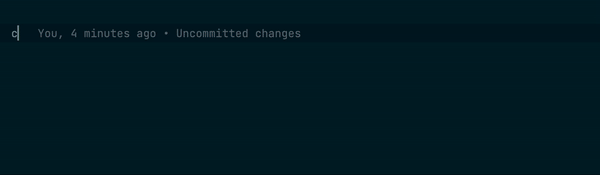

# Playground

We aim to ensure that how software across alis.exchange operates, communicates and integrates is simple and consistent. Whether you are getting results from a model, updating a database or executing trades, all of these actions should feel familiar, irrespective of the language you are working in. This allows you to seamlessly adopt anything across alis.exchange without spending hours in obscure documentation and the toil of attempting to integrate it in your code.

What does that experience feel like? This playground provides a glimpse of the ease of interacting with software built on alis.exchange in the various supported languages.

## Getting Started
Clone the repo and install the required dependencies to experience the elegance of gRPC services.

Global definitions are found in the _.proto_ file. These definitions are language agnostic and are propagated throughout the services. Experience it first-hand by typing `client.`.

